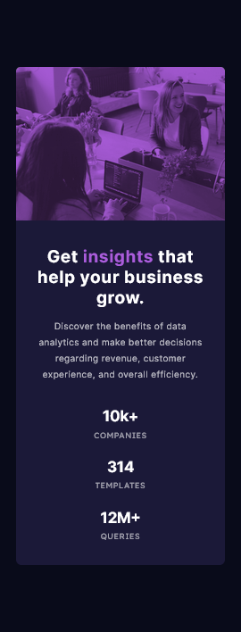

# Frontend Mentor - Stats preview card component solution

This is a solution to the [Stats preview card component challenge on Frontend Mentor](https://www.frontendmentor.io/challenges/stats-preview-card-component-8JqbgoU62). Frontend Mentor challenges help you improve your coding skills by building realistic projects. 

## Table of contents

- [Overview](#overview)
  - [The challenge](#the-challenge)
  - [Screenshot](#screenshot)
  - [Links](#links)
- [My process](#my-process)
  - [Built with](#built-with)
  - [What I learned](#what-i-learned)
  - [Continued development](#continued-development)
  - [Useful resources](#useful-resources)
- [Author](#author)

## Overview

### The challenge

Users should be able to:

- View the optimal layout depending on their device's screen size

### Screenshot




### Links

- Solution URL: [Solution](#)
- Live Site URL: [Live Demo](#)

## My process

### Built with

- Semantic HTML5 markup
- CSS custom properties
- Flexbox
- CSS Grid
- Mobile-first workflow
- CSS Vendor Prefixes

### What I learned

In this project I learned to used `mix-blend-mode` property. The `mix-blend-mode` CSS property sets how an element's content should blend with the content of the element's parent and the element's background.

To see how you can add code snippets, see below:

```html
<div class="card-img">
  <picture>
    <source srcset="assets/images/image-header-desktop.jpg" media="(min-width: 800px)">
    
  </picture>
</div>
```
```css
.card-img {
	position: relative;
}
.card-img::after {
	content: "";
	position: absolute;
	top: 0;
	right: 0;
	bottom: 0;
	left: 0;
	width: 100%;
	height: 100%;
	mix-blend-mode: multiply;
	background-color: var(--Soft-violet);
}
```

### Continued development

Between 600px and 800px width, a simple design was considered for the tablet, to eliminate free space

### Useful resources

- [MDN](https://developer.mozilla.org/en-US/docs/Web/CSS/mix-blend-mode) - This helped me learn about `mix-blend-mode` property. I really liked this pattern and will use it going forward.

## Author

- Frontend Mentor - [@James-alderson](https://www.frontendmentor.io/profile/James-alderson)